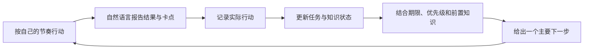

# PersonalHub

PersonalHub 是一个本地优先、由 Markdown 驱动的个人规划与学习框架。它让学习者按自己的节奏行动，再把实际结果告诉 AI；AI 负责保存上下文、更新计划、识别知识缺口，并给出一个具体且可验证的下一步。

它主要解决三个问题：

1. 学习、课程、研究和生活目标分散，难以持续判断现在最值得做什么。
2. AI 对话结束后容易失去个人背景、历史决定和已有知识状态。
3. 计划容易变成静态任务表，无法根据真实进度、错误和新增期限调整。

PersonalHub 不要求机械执行固定日程。它保存的是可修订的决定，并根据实际反馈重新规划。

## 核心工作方式



最常见的一句话是：

> 我刚完成了 `[内容]`，结果是 `[产出/进度/卡点]`。帮我记录并告诉我下一步。

AI 应当完成以下工作：

- 把学习者明确报告的行动写入当日日志；
- 把变化后的任务进度和阻塞同步到相关领域；
- 只有出现解释、解题、代码、实验或迁移应用等证据时，才更新知识状态；
- 根据硬期限、当前目标、知识前置关系和可用时间，推荐一个主要下一步；
- 为下一步给出可观察的完成标准；
- 不把未执行的建议累计成“欠账”。

## 公开层与私有层

仓库把可复用规则和个人数据分开。

| 层级 | 内容 | 是否提交 Git |
|---|---|---|
| 公开层 | AI 协作规则、领域规则、空白模板、架构说明 | 可以提交 |
| 私有层 | 个人背景、真实路径、目标、课表、期限、学习进度、知识证据、复盘和协作历史 | 必须忽略 |

私有 Markdown 文件统一使用 `.local.md` 后缀。包含私有附件或导出物的 `introduction/`、`reminders/` 和 `worklog/` 会被整目录忽略。

GitHub 上不会显示私有状态。克隆仓库后得到的是一套空白框架，使用者需要在本机根据模板建立自己的状态文件。

## 目录结构

下面展示的是完整的概念结构。带“私有”的文件或目录不会出现在 GitHub 中。

```text
PersonalHub/
├── AGENTS.md                         # 公开：AI 的全局协作协议
├── README.md                         # 公开：使用说明
├── .gitignore                        # 公开：隐私边界
│
├── PROFILE.local.md                  # 私有：稳定背景和协作偏好
├── GOALS.local.md                    # 私有：长期方向与阶段目标
├── DASHBOARD.local.md                # 私有：当前优先级、期限与冲突
├── PATHS.local.md                    # 私有：现有资料、本机路径和私有链接
├── INBOX.local.md                    # 私有：尚未讨论和归类的想法
│
├── areas/
│   ├── academics/
│   │   ├── AGENTS.md                 # 公开：课程学习规则
│   │   ├── STATUS.local.md           # 私有：课程进度、任务和阻塞
│   │   └── KNOWLEDGE.local.md        # 私有：概念证据、误区和复查点
│   ├── research/
│   ├── self-study/
│   └── life/
│
├── introduction/                     # 私有整目录：阶段与宏观自述、课表等背景
├── reviews/
│   ├── README.md                     # 公开：复盘约定
│   ├── YYYY-Www-daily.local.md       # 私有：一周的每日滚动日志
│   └── YYYY-Www.local.md             # 私有：周复盘
├── worklog/                          # 私有整目录：AI 与学习者的协作结果
├── reminders/                        # 私有整目录：日历等提醒导出物
│
├── templates/                        # 公开：所有私有状态的空白模板
└── docs/
    └── ARCHITECTURE.md               # 公开：设计原则和扩展方式
```

## 各状态文件的职责

不同文件回答不同问题，避免把历史、计划和知识判断混在一起。

| 文件 | 回答的问题 | 典型更新时机 |
|---|---|---|
| `PROFILE.local.md` | 我是谁，偏好怎样协作和学习？ | 稳定背景或长期偏好发生变化 |
| `GOALS.local.md` | 我长期和当前阶段希望获得什么结果？ | 目标经过讨论确认、完成或暂停 |
| `DASHBOARD.local.md` | 目前最重要的事情、期限和跨领域冲突是什么？ | 新增期限、优先级变化、周复盘后 |
| `PATHS.local.md` | 原始课程、研究、项目和参考资料在哪里？ | 新资料确实会被后续任务使用 |
| `INBOX.local.md` | 哪些想法还没有讨论和归类？ | 临时想到新方向，但尚未决定是否投入 |
| `introduction/` | 当前阶段如何自我描述？宏观动机和约束是什么？ | 新阶段开始或学习者主动补充自述 |
| `areas/*/STATUS.local.md` | 这个领域当前在做什么，进度和阻塞是什么？ | 报告行动、任务变化或取得可验证结果 |
| `areas/*/KNOWLEDGE.local.md` | 哪些概念已有何种证据？误区和下次检查是什么？ | 出现概念级解释、练习、代码或反例证据 |
| `reviews/*-daily.local.md` | 今天实际发生了什么？ | 学习者报告行动或结束当天学习时 |
| `reviews/YYYY-Www.local.md` | 本周计划与实际有何差异？ | 每周复盘 |
| `worklog/YYYY-MM.local.md` | 本次协作改变了什么？ | 产生决定、文件、教学材料或验证结果时 |

每日学习日志和协作工作日志并不相同：

- 每日学习日志记录学习者实际做了什么、结果和阻力；
- 协作工作日志记录 AI 与学习者共同做出的决定、文件改动、验证和待办；
- 工作日志不能作为学习者掌握知识的证据。

## 快速开始

### 1. 获取仓库

```bash
git clone [仓库地址] PersonalHub
cd PersonalHub
```

在这个目录中启动 Codex，使其读取根目录的 `AGENTS.md`：

```bash
codex
```

### 2. 初始化私有状态

首次使用时，可以直接告诉 Codex：

> 根据 `templates/` 初始化 PersonalHub 的私有状态。先创建 PROFILE、GOALS、DASHBOARD、PATHS 和 INBOX；只记录我明确确认的信息，所有个人文件使用 `.local.md` 并保持 Git 忽略。

也可以手动复制最小模板。不要覆盖已经存在的本地状态：

```bash
cp -n templates/profile.md PROFILE.local.md
cp -n templates/goals.md GOALS.local.md
cp -n templates/dashboard.md DASHBOARD.local.md
cp -n templates/paths.md PATHS.local.md
cp -n templates/inbox.md INBOX.local.md
```

领域状态只在真正开始使用该领域时创建。例如：

```bash
cp -n templates/area-status.md areas/academics/STATUS.local.md
cp -n templates/knowledge-state.md areas/academics/KNOWLEDGE.local.md
```

`KNOWLEDGE.local.md` 是可选文件。只有积累了足够的概念级学习证据时才需要创建。

### 3. 完成第一次规划

第一次对话建议提供以下信息：

- 当前阶段和最重要的目标；
- 已确认的截止日期和固定日程；
- 目前正在学习或推进的领域；
- 每周大致可用时间和单次专注时长；
- 已知知识基础、困难和希望采用的教学方式；
- 明确暂停或暂时不投入的方向。

AI 会把稳定背景写入 Profile，把目标写入 Goals，把当前优先级和期限写入 Dashboard，并为活跃领域建立状态。

## 日常使用

### 开始学习前

告诉 AI 当前可用时间、精力和新增期限：

> 我今天有 90 分钟，精力 3/5，没有新增期限。根据当前状态告诉我先做什么。

AI 应优先给出一个主要行动，必要时增加一个次要行动，而不是生成整天的机械时间表。

### 完成或卡住时

直接报告事实：

> 我做了 40 分钟作业，完成两题，第三题不会建立积分。帮我记录并给出下一步。

报告最好包含以下信息，但不强制填写完整模板：

- 做了什么；
- 得到了什么结果或产物；
- 卡在哪里；
- 大致投入时间；
- 当前精力或是否准备结束。

没有报告的信息应保持未知，AI 不应补写推测。

### 请求教程时

可以直接说：

> 读取我的知识状态，从最早的未解决前置点开始讲，并先用一个短问题检查我现在的理解。

教程应复用已经证明掌握的部分，针对记录中的误区展开，并通过解释、题目、代码或实验形成新证据。

### 当天结束时

> 今天到这里。帮我记录结果，并留下明天开始时的第一个动作。

### 每周复盘时

> 读取本周每日记录，和我完成周复盘。比较计划与实际，再更新下周最多三个重点。

周复盘不要求补写漏记日期，也不把未完成建议自动转成债务。

## 未来安排如何形成

PersonalHub 不使用固定的自动排课算法。AI 按以下顺序判断下一步：

1. 已确认的硬期限、课程和外部承诺；
2. 当前阶段已经确认的重点；
3. 任务之间的知识前置关系；
4. 最近实际进度、错误和阻塞；
5. 当天可用时间、精力和恢复需要；
6. 同时激活的任务数量是否过多。

官方期限和内部检查点必须明确区分。内部检查点可以调整，官方期限只能在获得新信息后修改。

计划只负责帮助选择下一步。学习者仍然可以按自己的节奏行动，之后让系统根据真实结果重新规划。

## 知识状态如何判断

默认掌握等级为：

```text
初识 -> 能解释 -> 能在帮助下应用 -> 能独立应用 -> 待复习
```

| 等级 | 含义 |
|---|---|
| 初识 | 接触过概念，但没有足够的独立表现证据 |
| 能解释 | 可以不依赖现成答案说明概念、边界和例子 |
| 能在帮助下应用 | 在提示、脚手架或反馈下完成应用任务 |
| 能独立应用 | 能在新的、相近情境中独立选择并使用该知识 |
| 待复习 | 曾经达到较高水平，但新证据显示遗忘或表现不稳定 |

阅读、观看教程或接受 AI 解释只说明“已经接触”，不会自动提高等级。更有效的证据包括：

- 不看资料进行解释或推导；
- 独立解决题目并说明理由；
- 编写、运行和调试代码；
- 完成实验并解释结果；
- 批评一个方案或识别反例；
- 把知识迁移到新的例子。

如果新表现与旧记录冲突，保留矛盾证据并采用更保守的判断。

## 设计依据与边界

框架采用了一些常见的学习科学原则：

- **检索练习：** 用闭卷解释、做题和实现检查理解；
- **间隔复习：** 在后续学习块和周复盘中重新检查旧知识；
- **形成性评价：** 根据具体错误调整教学，而不是只记录完成时间；
- **自我调节学习：** 形成“计划—行动—反馈—调整”的循环；
- **认知负荷控制：** 一次优先给出少量、边界清晰的下一步。

这些原则有研究支持，但 PersonalHub 本身不是经过正式实验验证的智能排课系统。学习块长度、每周预算、掌握等级和内部检查点都是可调整的工作约定，应根据实际执行效果修订。

## 原始资料边界

课程、研究、项目和参考资料继续保留在原目录。PersonalHub 通过 `PATHS.local.md` 建立索引，不主动复制、移动或重命名原文件。

这样可以避免：

- 为了规划而破坏已有资料结构；
- 在 PersonalHub 中产生过期副本；
- 把私有研究材料意外加入公开仓库。

需要使用独立项目时，应进入该项目自己的仓库执行构建、测试和版本控制。

## 隐私规则

以下内容只能进入私有文件或被整目录忽略的位置：

- 真实姓名、学校、实验室和联系方式；
- 本机绝对路径、账号信息和私有链接；
- 课表、真实期限、成绩、进度和个人反思；
- 未公开的研究问题、数据和实验结果；
- 私有附件、日历导出物和协作历史。

当前 `.gitignore` 保护：

```gitignore
**/*.local.md
introduction/
reminders/
worklog/
private/
```

`.gitignore` 不能保护已经被 Git 跟踪的文件，也不能替代人工检查。不要使用 `git add -f` 强行加入上述路径。

密钥、访问令牌和密码不应写入任何文件，即使该文件已被忽略。

## 发布到 GitHub 前的检查

提交前依次运行：

```bash
git diff --check
git status --short --ignored
git ls-files '*.local.md' 'introduction/**' 'reminders/**' 'worklog/**'
git diff --cached --name-only
git diff --cached
```

检查标准：

1. `git ls-files` 的私有路径检查应当没有输出；
2. 暂存文件名中不应出现个人状态、附件或导出物；
3. 暂存差异中不应出现真实身份、本机绝对路径、私有链接、进度或未公开研究信息；
4. `git diff --check` 应当通过；
5. 推送前再次确认当前分支和远端仓库正确。

建议只暂存公开层：

```bash
git add .gitignore AGENTS.md README.md areas docs reviews templates
```

然后重新运行上面的暂存差异检查，再自行提交和推送。

## 限制

- Codex 不会在后台观察学习行为；没有报告的行动不会自动进入状态。
- 日历或 `.ics` 文件只是提醒导出物，创建文件不代表提醒已经启用。
- 打开新会话时，AI 依赖本地文件恢复上下文；未记录的信息可能丢失。
- 学习者自述是规划输入，不等于客观掌握证据。
- 框架不会自动替代学校平台、项目管理工具或原始课程资料。

## 扩展一个领域

1. 创建 `areas/<领域>/AGENTS.md`，写入稳定的协作和评价规则；
2. 从 `templates/area-status.md` 创建私有 `STATUS.local.md`；
3. 只有出现足够的概念级证据时，才从 `templates/knowledge-state.md` 创建 `KNOWLEDGE.local.md`；
4. 在 Dashboard 中激活该领域，并明确目标结果、状态和下一步；
5. 不因“可能有用”就同时激活所有兴趣方向。

更详细的设计说明见 [docs/ARCHITECTURE.md](docs/ARCHITECTURE.md)，模板映射见 [templates/README.md](templates/README.md)，复盘规则见 [reviews/README.md](reviews/README.md)。
